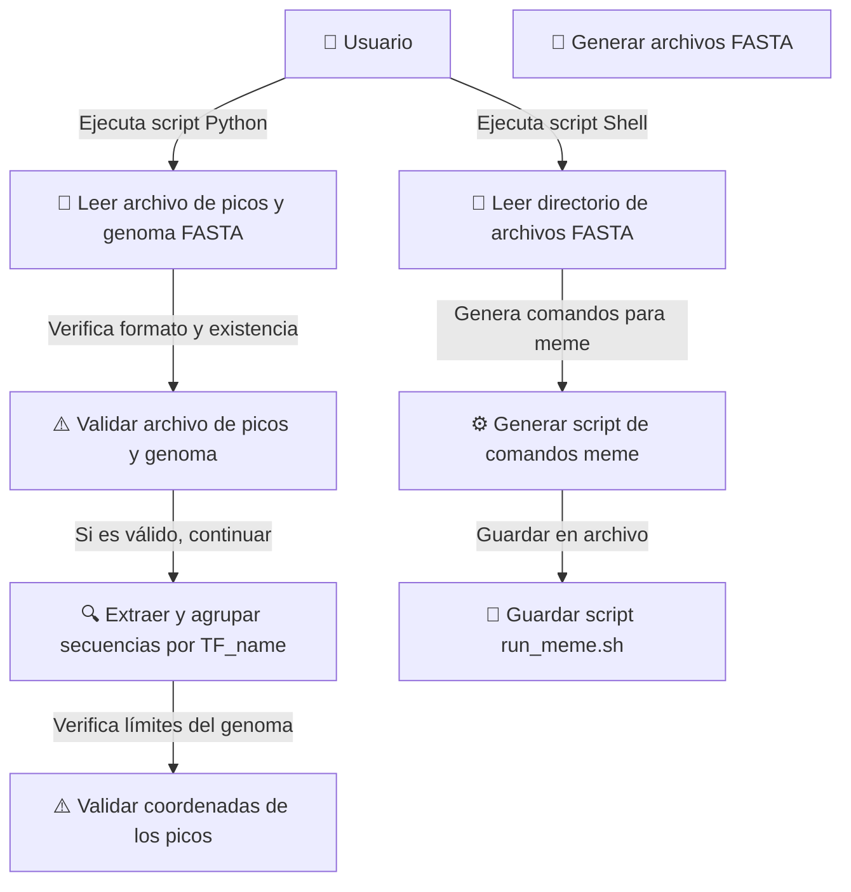

# Proyecto de Automatización para la Identificación de Sitios de Unión de Factores de Transcripción en E. coli en experimentos de ChIP-Seq

Fecha:11/03/2025

Participantes: 

- [Dulce Alejandra Carrillo Carlos]  email:carrillo@lcg.unam.mx 

## Descripción del Problema
<!-- Puedes empezar con una introducción, luego la justificación y plantear el problema. -->

El propósito de este proyecto es automatizar el proceso de extracción y análisis de regiones genómicas donde se lleva a cabo la unión de factores de transcripción en Escherichia coli. Para ello, se dispone de un archivo con los sitios de unión identificados y otro con la secuencia completa del genoma. La meta es generar archivos FASTA específicos para cada factor de transcripción, que contengan las secuencias correspondientes a sus sitios de unión. Posteriormente, estas secuencias serán analizadas con el programa MEME para descubrir motivos regulatorios. Para facilitar este análisis, se desarrollará un script en shell que ejecute automáticamente MEME con los archivos FASTA generados para cada factor.

## Especificación de Requisitos

1. **Requisitos Funcionales**

**A. Validación de formato de archivos**

- Implementar una función que revise si los archivos de entrada tienen el formato correcto antes de iniciar el análisis.

**B. Generación de Archivos FASTA a partir de sitios de unión**

**Input:**

El programa deberá aceptar como parámetros desde la línea de comandos los siguientes elementos:

- Archivo con la información de los sitios de unión para distintos factores de transcripción
- FASTA con la secuencia completa del genoma de *E. coli*.
- Argumento adicional que indique el directorio de destino donde se guardarán los archivos generados.

**Extracción de Secuencias:**

- A partir del archivo de picos, se deben identificar las coordenadas de inicio y fin correspondientes a los sitios de unión de cada TF (TF_name).
- Usando estas coordenadas, se deben extraer las secuencias específicas desde el archivo genómico FASTA, considerando únicamente la forward strand. 
- Es obligatorio verificar que las coordenadas se encuentren dentro de los límites del genoma; de no ser así, se debe notificar el error con un mensaje claro al usuario.

**Output (FASTA):**

- Para cada TF_name, se debe generar un archivo en formato FASTA nombrado según el identificador del factor de transcripción y almacenar en el directorio de salida esperado. 
- En caso de que un mismo TF_name aparezca en más de un experimento, se debe incluir el Dataset_Id correspondiente en el nombre del archivo para evitar ambigüedades.

---

**C. Automatización del Análisis de Motivos**

**Input:**

- Directorio que contenga los archivos FASTA generados previamente, cada uno con las secuencias de unión correspondientes a un TF.

**Script:**

- El programa debe recorrer todos los archivos FASTA dentro del directorio proporcionado.
- Para cada archivo, se debe construir una línea de instrucción que invoque el software MEME con los parámetros adecuados para realizar el análisis de motivos.
- Se debe crear un script en shell (`meme.sh`) que contenga todas las instrucciones para ejecutar MEME sobre cada uno de los archivos FASTA.

---

2. **Requisitos No Funcionales**

**Facilidad de Uso y documentación:**

- El sistema debe ser compatible con Linux, MAC y Windows. 
- La ejecución será desde la línea de comandos
- El código debe implementarse utilizando Python y/o scripts en shell.
- Debe existir un manual de uso accesible que descirba como usarlo y enliste posibles problemas y como solucionarlos.
- Todo el código debe estar debidamente comentado y acompañado de documentación clara.

**Software:**

- Se deberá utilizar un sistema de control de versiones para documentar y revisar el desarrollo del proyecto.
- Es necesario realizar pruebas que validen el correcto funcionamiento del sistema.

**Diseño Modular:**

- El código debe estar organizado en módulos o funciones bien definidos, de forma que cada componente (extracción, validación, análisis, generación de script) pueda mantenerse y modificarse por separado.

## Análisis y Diseño

1. Fromato de datos de entrada 

**Dataset_Ids:**
    
    -   _Descripción:_ Identificadores únicos para cada conjunto de datos. Estaos IDs indican diferentes experimentos o condiciones bajo las cuales se determinaron los sitios de unión para los TFs.
    -   _Ejemplo:_ "DS001","DS002", etc.
-   **TF_name:**
    
    -   _Descripción:_ El nombre del factor de transcripción que se une al genoma en la región especificada.
    -   _Ejemplo:_ "AraC", "LacI", etc.

-   **Peak_start:**
    
    -   _Descripción:_ La posición inicial en el genoma donde comienza el pico de unión. Se refiere a la ubicación del primer nucleótido del pico.
    -   _Ejemplo:_ 345676, 123456, etc.

-   **Peak_end:**
    
    -   _Descripción:_ La posición final en el genoma donde termina el pico de unión. Se refiere a la ubicación del último nucleótido del pico.
    -   _Ejemplo:_ 345786, 123556, etc.

-   **Peak_center:**
    
    -   _Descripción:_ Posición central del pico de unión, calculada como el promedio o posición entre el `Peak_start` y `Peak_end`.
    -   _Ejemplo:_ 345731, 123501, etc.

-   **Peak_number:**
    
    -   _Descripción:_ Número secuencial utilizado para identificar picos dentro de un conjunto de datos. Esto es útil para referencias internas.
    -   _Ejemplo:_ 1, 2, 3, etc.

-   **Max_Fold_Enrichment:**
    
    -   _Descripción:_ Valor que representa el máximo enriquecimiento observado en el sitio de unión del pico.
    -   _Ejemplo:_ 15.4, 22.3, etc.

-   **Max_Norm_Fold_Enrichment:**
    
    -   _Descripción:_ Valor de máximo enriquecimiento normalizado, ajustado por un factor de control para comparaciones equitativas entre experimentos.
    -   _Ejemplo:_ 12.0, 20.1, etc.

-   **Proximal_genes:**
    
    -   _Descripción:_ Lista de genes cercanos al pico de unión, proporcionando contexto para el análisis funcional.
    -   _Ejemplo:_ "geneA, geneB", "geneX, geneY", etc.

-   **Center_position_type:**
    
    -   _Descripción:_ Denota la ubicación genómica del pico central, como intergénica, intrónica, etc.
    -   _Ejemplo:_ "intergénica", "intrónica", etc.

#### Módulo 1: Extractor y Creador de Secuencias FASTA

**Objetivo:** Extraer las secuencias genómicas correspondientes a los picos de unión de los factores de transcripción y generar archivos FASTA individuales para cada `TF_name`.

**Flujo de Trabajo:**

1.  **Lectura de Entradas:**
    
    -   Cargar el archivo de picos y el archivo FASTA del genoma.
    -   Obtener el directorio de salida desde la línea de comandos.
2.  **Procesamiento de Datos:**
    
    -   Leer cada fila del archivo de picos.
    -   Extraer los campos `TF_name`, `Peak_start`, `Peak_end` para cada entrada.
    -   Para cada `TF_name`, usar las posiciones `Peak_start` y `Peak_end` para extraer la secuencia correspondiente del archivo FASTA del genoma.
3.  **Generación de FASTA:**
    
    -   Agrupar las secuencias extraídas por `TF_name`.
    -   Crear un archivo FASTA por cada `TF_name` en el directorio de salida con la misma estructura `<TF_name>.fa`.


**Algoritmo**

```
1. Inicio
2. Leer archivo de picos
3. Para cada registro:
   a. Obtener TF_name, Peak_start, Peak_end
   b. Extraer secuencia del genoma usando Peak_start y Peak_end
   c. Agrupar secuencias por TF_name
4. Por cada TF_name:
   a. Crear archivo FASTA
   b. Escribir secuencias en archivo
5. Fin
```

#### Módulo 2: Automatizador del Análisis con `meme`

**Objetivo:** Generar un script de shell que contenga todos los comandos necesarios para ejecutar `meme` en los archivos FASTA generados para cada factor de transcripción.

**Flujo de Trabajo:**

1.  **Lectura de Entradas:**
    
    - Directorio con archivos fasta.
    
2.  **Generación de Comandos:**
    
    -   Iterar sobre cada archivo `.fa` en el directorio.
    -   Generar una línea de comando para ejecutar `meme` usando cada archivo FASTA.
    -   Incluir opciones necesarias (por ejemplo, `-oc <output_directory>`, `-mod oops`, etc.) y asegurar nombrar el directorio de salida para cada ejecución de `meme`.
3.  **Salida del Script:**
    - salida a pantalla
    

**Algoritmo:**

```plaintext
1. Inicio
2. Leer todos los archivos FASTA en el directorio
3. Para cada archivo FASTA:
   a. Formar comando: meme <archivo_fasta> -oc <nombre_directorio> ... 
   b. Imprimir comando
4. Redireccionar salida a un archivo script: run_meme.sh
5. Fin
``` 

### Diagrama de Caso de Uso (PlantUML) para Visualizar el Proceso:

Usar un editor para visualizar el diagrama <https://sujoyu.github.io/plantuml-previewer/>

```
@startuml
actor "Usuario" as usuario

rectangle "Python" {
    usecase "Leer archivo de picos y genoma FASTA" as UC1
    usecase "Extraer y agrupar secuencias por TF_name" as UC2
    usecase "Generar archivos FASTA" as UC3
}

rectangle "Shell" {
    usecase "Leer directorio de archivos FASTA" as UC4
    usecase "Generar script de comandos meme" as UC5
}

usuario --> UC1 : Ejecuta script Python
UC1 --> UC2
UC2 --> UC3 : Guarda archivos FASTA
usuario --> UC4 : Ejecuta script Shell
UC4 --> UC5 : Crea script de ejecución de meme

@enduml
```

En formato mermaid , que stackEdit sí reconoce.

